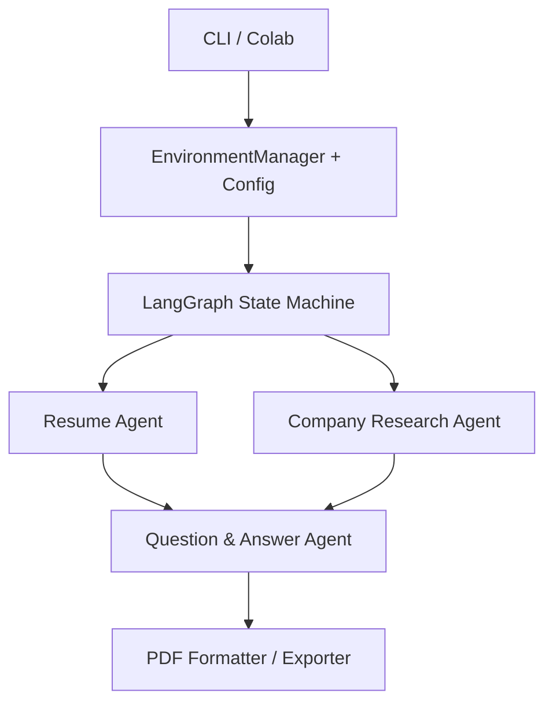

# Technical Interview Preparation System (TIPS)

**Team:** Emma Berry, Luca Chierotti, and Christina Wong

This Markdown report is adapted from the team's final course report. The surviving materials do not preserve a reliable per-person task breakdown, so the system is documented as a shared team deliverable.

## 1. System Overview

TIPS generates interview-preparation material tailored to a specific technical role. It analyzes a user's resume, a job description, and company information, then produces a detailed PDF containing domain-specific questions, sample answers, rationales, and company context.

The pipeline is managed by LangGraph. At each stage, a specialized LangChain agent performs one responsibility:

1. **Resume Analysis Agent**
   - Ingests the resume.
   - Retrieves and summarizes the candidate's key skills and projects.
2. **Company Research Agent**
   - Ingests and cleans the job description.
   - Retrieves the most relevant technical requirements.
   - Uses Tavily web search to gather company information.
   - Produces a structured company profile.
3. **Technical Question Generation Agent**
   - Combines the resume analysis, job requirements, and company profile.
   - Generates role-specific technical and behavioral questions, answers, and rationales.
4. **Report Formatter / Exporter**
   - Combines the outputs into a styled PDF report.



## 2. Core Components

### 2.1 Setup and configuration

The setup layer ensures that the required libraries, parameters, and credentials are available. A requirements checker detects missing packages, while a centralized `Config` dataclass stores paths, chunking parameters, model settings, and retrieval controls.

`EnvironmentManager` supports both Colab and local execution. The original course workflow discovered API-key files in a private Google Drive; local execution falls back to environment variables. No credentials are stored in this repository.

### 2.2 Document handling and retrieval-augmented generation

`DocumentCleaner` prepares job-description PDFs for retrieval. It uses regular expressions and repeated-line analysis to remove URLs, legal disclaimers, page numbers, separator lines, repeated headers/footers, and other boilerplate. Lines are discarded when they are empty or very short, repeated across a significant portion of the document, or matched by a configured noise pattern.

`VectorStoreManager` manages document ingestion and retrieval:

- selects an appropriate loader for PDF, DOCX, or TXT files;
- splits documents with `RecursiveCharacterTextSplitter`;
- generates Hugging Face embeddings;
- stores chunks and metadata in persistent ChromaDB collections; and
- performs Maximal Marginal Relevance retrieval to return diverse, high-relevance context.

### 2.3 Tools

Three single-responsibility tools are exposed to the agents:

#### `resume_ingest`

Loads a resume, splits it into chunks, stores the chunks in a `resumes` collection, queries for key skills and projects, and returns a consolidated facts string.

#### `company_research`

Cleans and indexes the job description, retrieves segments related to technical requirements, performs a Tavily company search, and prompts the language model to produce structured JSON describing the company's technology stack, culture, recent developments, and mission.

#### `qa_generate`

Combines candidate facts and company/job facts in a prompt that requests a numbered Markdown set of technical and behavioral questions with detailed answers and rationales.

### 2.4 LangGraph pipeline and agents

The pipeline uses a typed state dictionary whose fields are populated as execution proceeds. Representative fields include:

- `resume_path`
- `job_path`
- `company_query`
- `resume_facts`
- `company_profile`
- `job_facts`
- `qa_markdown`

`InterviewPrepPipeline` creates the vector-store manager, tools, and three agents. The agent nodes execute in this order:

```text
START -> resume_node -> company_node -> qa_node -> END
```

The public `run()` method initializes the state, invokes the compiled graph, and returns the company profile and generated interview questions/answers.

### 2.5 User interface and output

A conventional `argparse` CLI accepts resume, job-description, output-path, and verbose flags. After pipeline execution, `format_final_output()` creates the human-readable report structure and `create_styled_pdf()` exports it through ReportLab.

## 3. Technologies

- Python
- PyTorch environment / CUDA availability checks
- LangGraph and LangChain
- OpenAI API
- Hugging Face embeddings
- ChromaDB
- Tavily Search
- PyPDFLoader, DOCX, and text ingestion
- ReportLab PDF generation
- Google Colab and command-line execution

## 4. Running the course-project snapshot

The notebook supports both interactive Colab use and a command-line flow. To run it:

1. Create an isolated Python environment.
2. Install the dependencies listed by the notebook's requirements checker.
3. Provide OpenAI and Tavily credentials through environment variables or external local key files.
4. Supply a resume, job description, company query, and output path.
5. Run the notebook or CLI entry point.

The original report used a private shared-Drive directory structure for input and output files. That private path is not required by the system design and is intentionally not reproduced as a public dependency here.

## 5. Scope and limitations

- This is a graduate-course prototype, not a maintained production service.
- It depends on third-party APIs and package versions that may have changed since the project was completed.
- Generated interview material should be reviewed for factuality and relevance.
- Because the original division of labor is no longer recoverable, this repository does not attribute individual subsystems to particular team members.
