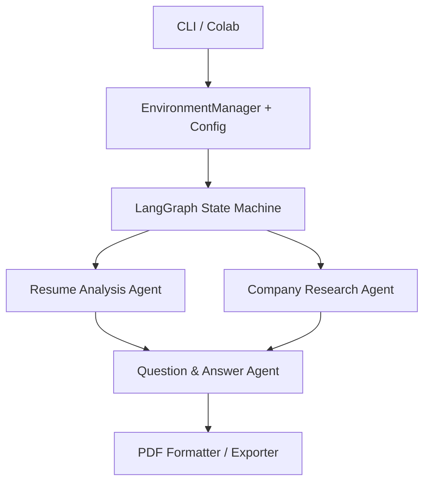

# Technical Interview Preparation System (TIPS)

TIPS is a collaborative graduate-course project that generates role-specific technical interview preparation material from a candidate's resume, a job description, and company information.

**Team:** Emma Berry, Luca Chierotti, and Christina Wong

## What the system does

TIPS produces a formatted interview-preparation report containing:

- a summary of the candidate's relevant skills and projects
- a researched company profile
- job-specific technical and behavioral questions
- sample answers and rationales
- a final styled PDF report

## Architecture

The pipeline uses LangGraph to orchestrate three specialized LangChain agents:

1. **Resume Analysis Agent** - ingests a resume and extracts key skills and projects.
2. **Company Research Agent** - combines job-description retrieval with Tavily web research to build a structured company profile.
3. **Question Generation Agent** - combines candidate and company context to create tailored technical and behavioral questions with answers.

## Retrieval and document processing

The project includes:

- PDF, DOCX, and TXT ingestion;
- a `DocumentCleaner` that removes repeated headers, URLs, disclaimers, page numbers, and other boilerplate
- recursive text chunking
- Hugging Face embeddings
- persistent ChromaDB collections
- Maximal Marginal Relevance retrieval for diverse, high-relevance context

## Implementation notes

- The notebook imports PyTorch and checks CUDA availability, but the retrieval pipeline uses Hugging Face embeddings through LangChain
- BYO API Keys
- The original implementation supports both a Colab/Google Drive workflow and a conventional command-line interface

## Documentation

See [Project Report and Readme](./Project_Report_and_Readme.md) for a detailed description of the architecture, tools, agents, retrieval pipeline, user interface, and original run instructions.
